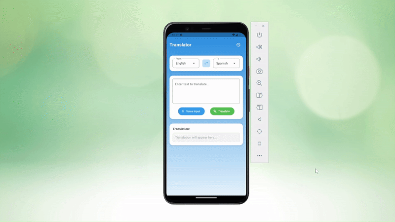

# Flutter Language Translator 🌐


[](https://github.com/DMounas/translator_app/stargazers)
[](https://github.com/DMounas/translator_app/network/members)

A powerful and intuitive language translator application built with Flutter. This app allows for seamless text and voice translation between multiple languages, featuring a clean user interface and persistent translation history.

---

## 📸 App Demo

<p align="center">
  
</p>


---

## ✨ Features

-   **Text Translation:** Translate typed text between a wide variety of languages.
-   **Voice-to-Text Input:** Use your device's microphone to speak and instantly get text for translation.
-   **Text-to-Speech Output:** Listen to the pronunciation of the translated text.
-   **Language Swap:** Quickly swap the 'From' and 'To' languages with a single tap.
-   **Translation History:** Automatically saves your translations for future reference.
-   **Clear History:** Option to clear all saved translation history.
-   **Modern UI:** A clean, responsive, and user-friendly interface with custom widgets.
-   **Cross-Platform:** Single codebase for both Android and iOS.

---

## 🔧 Tech Stack & Dependencies

-   **Framework:** [Flutter](https://flutter.dev/)
-   **Language:** [Dart](https://dart.dev/)
-   **API:** [Google Cloud Translation API](https://cloud.google.com/translate)
-   **Key Packages:**
    -   `http`: For making API requests.
    -   `speech_to_text`: For voice input functionality.
    -   `flutter_tts`: For text-to-speech output.
    -   `shared_preferences`: For local storage of translation history.

---

## 🚀 Getting Started

Follow these instructions to get a copy of the project up and running on your local machine for development and testing.

### Prerequisites

-   [Flutter SDK](https://flutter.dev/docs/get-started/install) (version 3.x or higher)
-   An editor like [VS Code](https://code.visualstudio.com/) or [Android Studio](https://developer.android.com/studio)
-   A configured emulator or a physical device to run the app.

### Installation & Setup

1.  **Clone the repository:**
    ```bash
    git clone https://github.com/DMounas/translator_app
    ```

2.  **Navigate to the project directory:**
    ```bash
    cd translator_app
    ```

3.  **Install dependencies:**
    ```bash
    flutter pub get
    ```

4.  **Configure the API Key:**
    This project requires a Google Cloud Translation API key. Follow the steps in the [API Configuration](#-api-configuration) section below.

5.  **Run the app:**
    ```bash
    flutter run
    ```

---

## 🔑 API Configuration

This app uses the Google Cloud Translation API, which requires a valid API key to function.

1.  **Get an API Key:**
    -   Go to the [Google Cloud Console](https://console.cloud.google.com/).
    -   Create a new project and enable the **"Cloud Translation API"**.
    -   Ensure you have **Billing enabled** for the project (a free tier is available).
    -   Go to "APIs & Services" > "Credentials" and create a new API key.

2.  **Add the Key to the Project:**
    -   In the `lib` folder, create a new folder named `api`.
    -   Inside the `api` folder, create a new file named `api_keys.dart`.
    -   Add your API key to this file like so:
        ```dart
        // lib/api/api_keys.dart
        const String googleApiKey = 'YOUR_REAL_API_KEY_GOES_HERE';
        ```

3.  **Secure Your Key (Crucial):**
    -   To prevent your secret API key from being exposed on GitHub, open the `.gitignore` file in the root of the project.
    -   Add the following line to the end of the file:
        ```
        # Secret API keys
        /lib/api/api_keys.dart
        ```

---

## 📜 License

This project is licensed under the MIT License - see the `LICENSE` file for details.